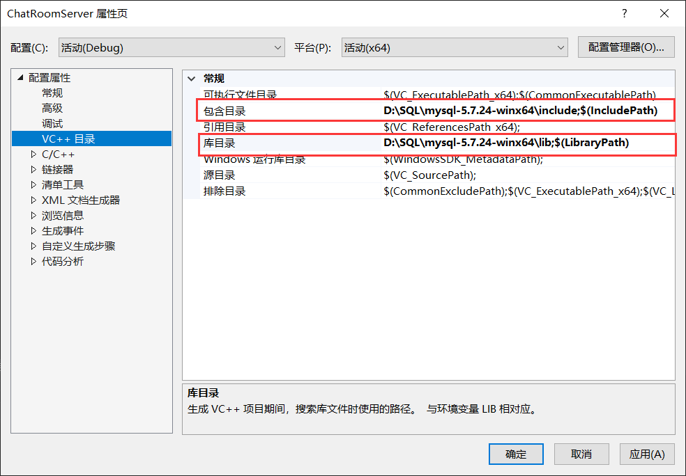
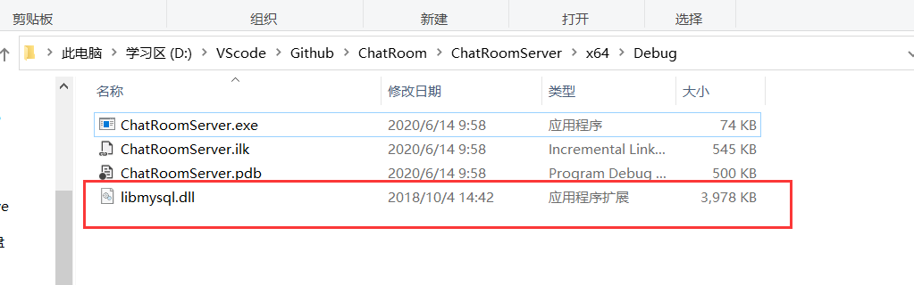
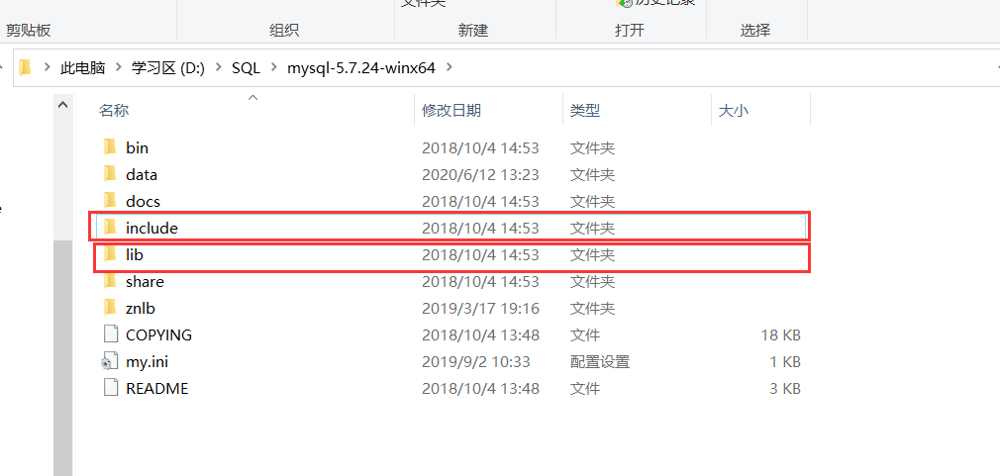
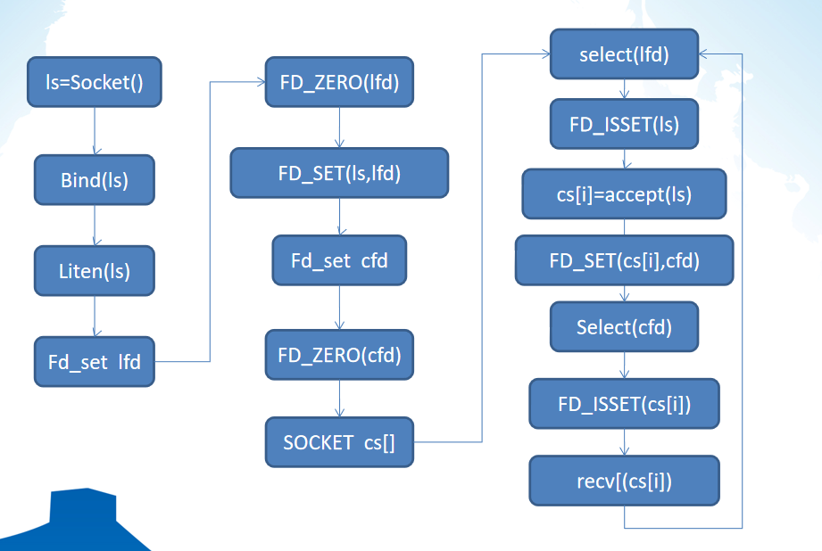

# ChatRoom

## 1 环境

#### 1.1 VS2019

**1.1.1 控制台应用**  

**1.1.2 配置MySQL**  

(1) 在文件项目属性中添加包含 MySQL 目录(include 与 lib)  

(2) 将 libmysql.dll 添加在调试目录下(Debug/Release)  

(3) libmysql.dll 在 lib 中

**1.1.3 配置文件**

(1) config.txt  
连接 MySQL 信息（详情自己查看）

(2) test.sql  
测试 MySQL 信息（详情自己查看）

## 2 思路

#### 2.1 socket

**2.1.1 版本**

winsocket2

**2.1.2 Select 模型**

服务端采用 Select 模型，轮询接收和发送，建立连接套接字数组

#### 2.2 聊天室

利用 MySQL 得到每个连接套接字的U_ID(唯一标识符)，管理连接套接字数组，实现服务端转发消息。

#### 2.3 文件传输

为了通用消息传输，构建结构体，将发送信息进行分类，接收端就能够分类处理

## 3 实现

#### 3.1 服务端

(1) 连接 MySQL  
(2) 自定义封装 MySQL 各种功能  
(3) 创建 Select 模型  
(4) 管理socket：接收客户端 socket，接收第一个信息得到对应 U_ID，断开连接删除信息  
(5) 聊天：查询目的socket，通过 to_id(friend/group) 得到 socket，实现消息转发  
(6) 文件：上传、下载（绝对路径）  

#### 3.2 客户端

(1) 连接 MySQL  
(2) 自定义封装 MySQL 各种功能  
(3) 自定义封装菜单  
(4) 创建 socket  
(5) 登录服务器，发送自己信息  
(6) 选择分类(friend/group)，选择具体对象(friend_id/group_id)  
(7) 聊天：发送消息、多线程接收消息  
(8) 文件：上传、下载（绝对路径）  

## 4 运行

#### 4.1 MySQL

在 MySQL 中导入执行 test.sql，根据自己 MySQL 信息配置 config.txt

#### 4.2 ChatRoom

将 VS2019 环境配置好，直接调试即可（exe 运行也可以）